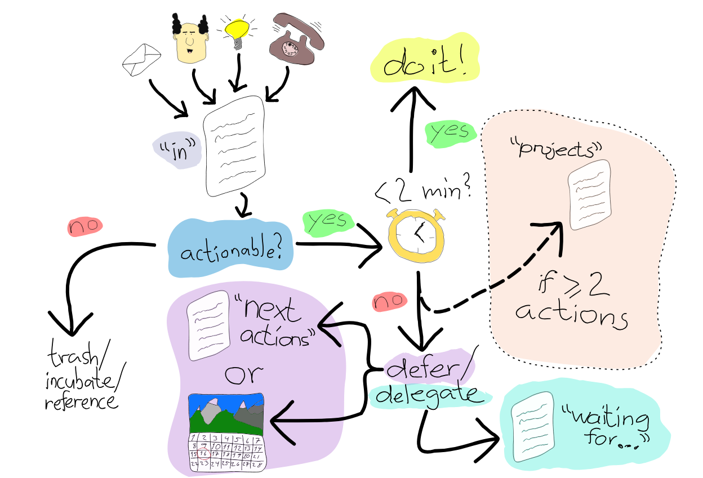

# How to apply GTD (Getting Things Done)
#tasks #howtodo #method #completeness

- Create the lists of things separated by
	- In
	- Next Actions
	- Waiting For
	- Projects
	- Some day/maybe
- Inbox with tasks to be processed: [[3orp-in-list-on-gtd]]#

- Image above shows the loop given the inbox loop:
	- Important point here, is to think about a task (actionable item) as the next ==physical, visible action== to move the
	project closer to its goal. This action need to be clear and concise.

	- If an item ==is not== actionable transforms into reference/incubated item or goes to the trash
		- I did not understand this article, going to take a look on this in ==two weeks==
		- Learn Spanish going to ==some day/maybe==
	- If an item ==is== actionable, so:
		- Less than 2 minutes: do it
		- More than 2 minutes, you have to ==postpone== to a specific time to ==next actions==
			- If more than two actions is necessary, it goes to project folder
- "next actions" = "as-soon-as-possible actions"
- "waiting for" = "it is waiting for something to happens before it been done"
- "some day/maybe" list
	- Not lose the track you need to review it sometimes
	- These are ideas of project not yet too "solid" to be on project list
	- Can be review weekly
	- Goes to calendar maybe?
- "project list" = it is extensively list of actions to be done with a goal to some end
	- Need to be review time to time
	- Need to add one task of project in ==next action== to complete the goal of the project
	- Make sure you have time for the task from a project
	- Remove a project if you not do it anymore
- Context tags are tags used on which circumstances a task need to be done/appear/start:
	- @everywhere = Can be done on mobile/pc on every local
	- @city = Need to be done in a city/local
	- @the worldwide webs = Need to be done on internet
- Agenda contexts
	- Tags about what you want to discuss on the meeting
- Calendar
	- Use calendar only for tasks that have really a deadline for it
- ==Best practices==:
	- hard edges between you lists.
	- Use a tool to make it easy to collect small tasks, but not too complex or too fun to not spend too much time on the tool itself.
	- Have a folder for read/review papers, documents and anything you want to read.
	- Tickler file: files you need in a specific day/month/year, tasks to be done in a specific date, j

### References
- https://hamberg.no/gtd
