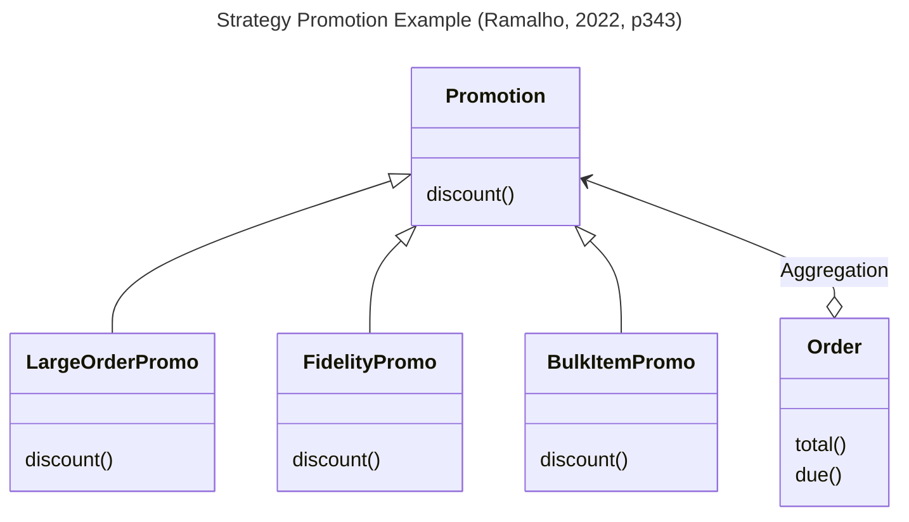

# Python Strategy
#designpattern #datastructure #programming #python #class #apply




```python
from abc import ABC, abstractmethod
from collections.abc import Sequence
from decimal import Decimal
from typing import NamedTuple, Optional

class Customer(NamedTuple):
    name: str
    fidelity: int

class LineItem(NamedTuple):
    product: str
    quantity: int
    price: Decimal
    def total(self) -> Decimal:
        return self.price * self.quantity

class Order(NamedTuple):  # the Context
    customer: Customer
    cart: Sequence[LineItem]
    promotion: Optional['Promotion'] = None
    def total(self) -> Decimal:
        totals = (item.total() for item in self.cart)
		return sum(totals, start=Decimal(0))
    def due(self) -> Decimal:
        if self.promotion is None:
            discount = Decimal(0)
        else:
            discount = self.promotion.discount(self)
        return self.total() - discount
    def __repr__(self):
        return f'<Order total: {self.total():.2f} due: {self.due():.2f}>'

class Promotion(ABC):  # the Strategy: an abstract base class
    @abstractmethod
    def discount(self, order: Order) -> Decimal:
        """Return discount as a positive dollar amount"""

class FidelityPromo(Promotion):  # first Concrete Strategy
    """5% discount for customers with 1000 or more fidelity points"""
    def discount(self, order: Order) -> Decimal:
        rate = Decimal('0.05')
        if order.customer.fidelity >= 1000:
            return order.total() * rate
        return Decimal(0)

class BulkItemPromo(Promotion):  # second Concrete Strategy
    """10% discount for each LineItem with 20 or more units"""
    def discount(self, order: Order) -> Decimal:
        discount = Decimal(0)
        for item in order.cart:
            if item.quantity >= 20:
                discount += item.total() * Decimal('0.1')
        return discount

class LargeOrderPromo(Promotion):  # third Concrete Strategy
    """7% discount for orders with 10 or more distinct items"""
    def discount(self, order: Order) -> Decimal:
        distinct_items = {item.product for item in order.cart}
        if len(distinct_items) >= 10:
            return order.total() * Decimal('0.07')
        return Decimal(0)

>>> joe = Customer('John Doe', 0)
>>> ann = Customer('Ann Smith', 1100)
>>> cart = (LineItem('banana', 4, Decimal('.5')),
...         LineItem('apple', 10, Decimal('1.5')),
...         LineItem('watermelon', 5, Decimal(5)))
>>> Order(joe, cart, FidelityPromo())
<Order total: 42.00 due: 42.00>
>>> Order(ann, cart, FidelityPromo())
<Order total: 42.00 due: 39.90>
>>> banana_cart = (LineItem('banana', 30, Decimal('.5')),
...                LineItem('apple', 10, Decimal('1.5')))
>>> Order(joe, banana_cart, BulkItemPromo())
<Order total: 30.00 due: 28.50>
>>> long_cart = tuple(LineItem(str(sku), 1, Decimal(1))
...                  for sku in range(10))
>>> Order(joe, long_cart, LargeOrderPromo())
<Order total: 10.00 due: 9.30>
>>> Order(joe, cart, LargeOrderPromo())
<Order total: 42.00 due: 42.00>
```
- As you can see the strategy concert class above only have one function. Given that, we can transform it to plain
  functions instead of use classes. We can take benefit of high order functions ([[a8bt-high-order-functions]]) and implement it in a more concise way.
	- [[2ot8-python-strategy-with-functions]]# and implement it in a more concise way and implement it in a more concise way.
- Usually `strategy` deal with data inside a context and does have internal state (instance attribute)
	- In the code above the context is the class `Order`
- [[o8vo-decorators-strategy]]#
